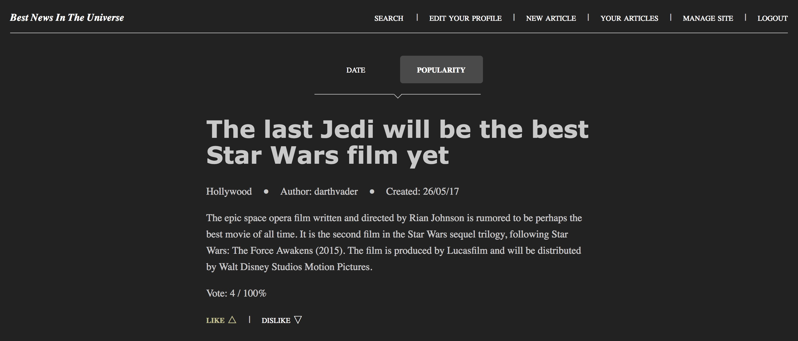

# Best News In the Universe
## NTNU i Gjøvik
### Assignment 2 - IMT3851
#### Audun Meek Olsen - Stud.nr. 140689

**DISCLAIMER**  
*This is an assignment for the Norwegian University of Science and Technology which is the university I currently attend (as of the latest commit for this project atleast). I'm not especially fond of the code in this project, but it has some genuinely good snippets, so I'm keeping it up here for future reference.*

**HOW TO USE**  
To start using this simple webpage, you need to setup the database and populate it with some dummydata, this is done by running setup.php from your browser. I run http://localhost:8888/Oblig2/setup.php from the browser to setup the database. This might differ depending on what server software you are using. You might also want to change the login credentials in the database class (/controllers/Database.php) depending on what server software you use. I use MAMP PRO, so the login credentials might differ if you're using e.g. XAMPP. Setting up the database redirects you to the index page, so the page is ready for use after this step. The page is fairly user-friendly and intuitive from this point on. Just click all the links in the navigation to try all the different functionality.

You can register a new user, but theres already some dummyusers both with and without admin privileges ready for use. You can see them all in /.setup.php Here's two of the users:

* Ordinary user
	* Username: darthvader
	* Password: starwars
	
* Admin user
	* Username: admin1
	* Passowrd: admin1
	
While using the different forms on the page, I encourage you to mess around with them to see the validation functionality I've implemented.

**PROJECT STRUCTURE**  
Quick notes on the structure of files and directories within this project.
php files in root are primarily html and contain little data logic. Files in controllers/ are files containing classes with misc functionality.
Files in controllers/functions/ contain misc functionality which the php files in root link to. scripts/ contain Javascript. This is because I've used Ajax for the rating sytsem. styles/ contain CSS.